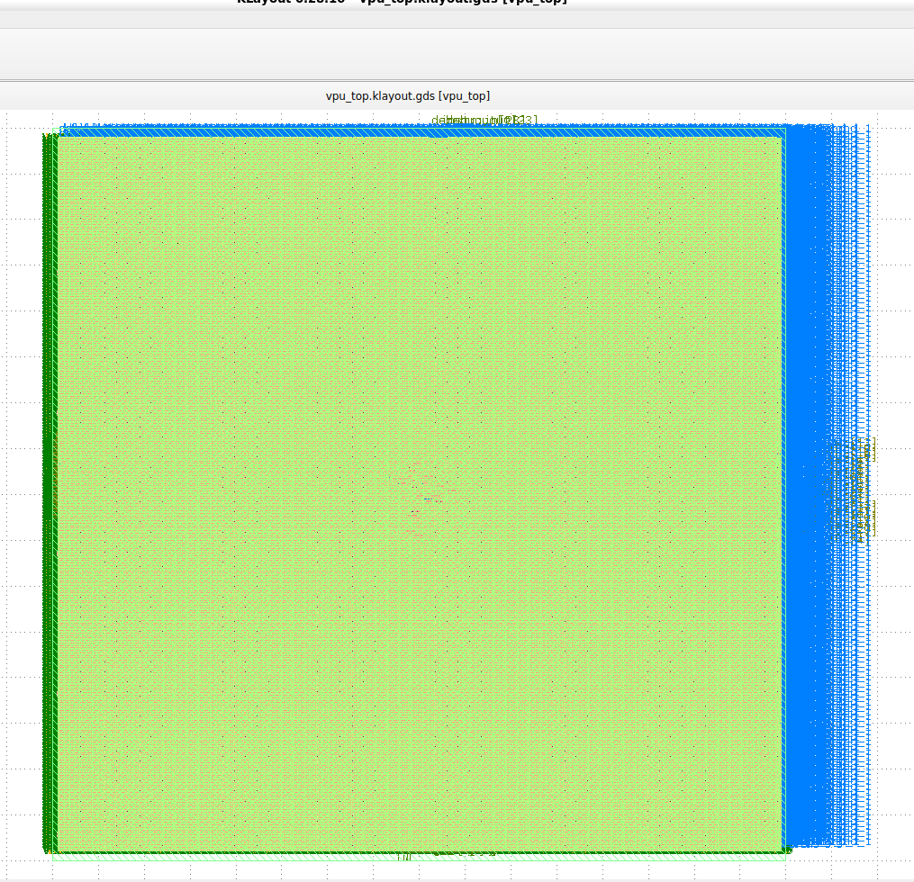

# RISC-V Vector Processing Unit (VPU) — ASIC Implementation

## Overview
This project implements a **5-stage RISC-V Vector Processing Unit (VPU)** and takes it through a complete RTL-to-GDSII ASIC flow using OpenLane + OpenROAD on Sky130 technology.

The design focuses on vector execution, multi-lane ALU operation, register file design, clock-tree synthesis, and physical signoff.

## Architecture
- **Pipeline Stages (5-stage):**
  1. Instruction Fetch
  2. Decode
  3. Execute (Vector ALU)
  4. Memory
  5. Writeback

- **Vector Features**
  - Parameterized vector length (VLEN)
  - Multi-lane vector ALU
  - Vector register file
  - Stall-aware execution stage

## RTL Modules
- `vpu_top` — Top-level integration
- `vector_alu` — Multi-lane vector ALU
- `vector_regfile` — Vector register file
- `ex_stage` — Execution pipeline stage
- Supporting control logic

## Physical Design Flow
- **Synthesis**: Yosys
- **Floorplanning & Placement**: OpenROAD
- **CTS**: Balanced clock tree insertion
- **Routing**: Global + Detailed routing
- **Signoff**:
  - DRC clean
  - LVS clean
  - Post-layout timing (SDF)

## Technology
- **PDK**: SkyWater SKY130
- **Standard Cells**: sky130_fd_sc_hd
- **Toolchain**: OpenLane (RTL → GDSII)

## Key Results
- Completed full RTL-to-GDSII flow
- Clock Tree successfully synthesized
- Final GDS verified in KLayout
- Post-layout SDF generated
- Area-optimized synthesis strategy
  
## Chip Layout (Final GDS)
### Full Chip View

### Clock Tree (CTS)

## Outputs
- **GDSII**: `results/gds/vpu_top.gds`
- **LEF**: `results/lef/vpu_top.lef`
- **Timing**: `results/timing/vpu_top.sdf`

---

## Author
**Vishwam Soni** 
RTL Design | ASIC Physical Design | RISC-V
